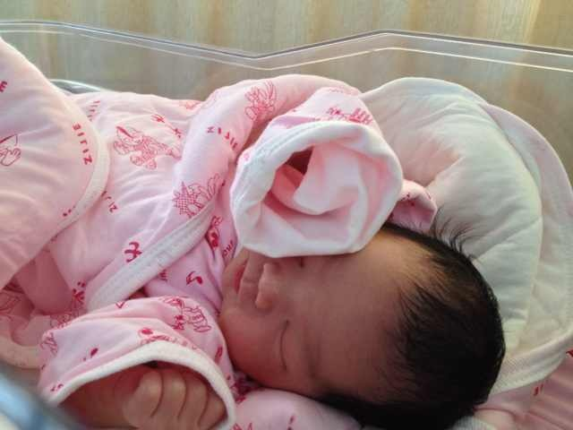

# 2013-12-27 礼物

上午去医院看妈妈和你。你小小的。有魏姨的照顾，爸爸的精力都放在妈妈身上了。

下午爸爸去了一趟公司，给老板做了工作汇报。大家都知道你的出生了，纷纷表示祝贺。晚上聚餐，恰好坐在老板身边，跟一桌总监、总经理说起你的出生。

圣诞节前好几天，你可爱的妈妈就把圣诞袜子挂起来了。爸爸悄悄托王流斌叔叔给妈妈买了一个小礼物，一个QQ公仔，圣诞装束，限量版。但是从周六开始发烧，周日开始打吊针，一直没能去公司拿。今天拿到了，晚宴之后，打车去医院，给你妈妈看。

晚宴时还中了一个小奖品——一只红色的小马。准备给你。但是你看了看，白了爸爸一眼，表示不屑。听说你脾气不小，吃奶着急。看来性格像我。

晚上回到家，看到妈妈的小姨从滕州赶到北京来看你。

奶奶今天去买布，准备做一个套子，把爸爸买的金属衣柜套起来。本来衣柜应该是木制的，但是怕有甲醛，对你身体不好，所以买一套金属的。

