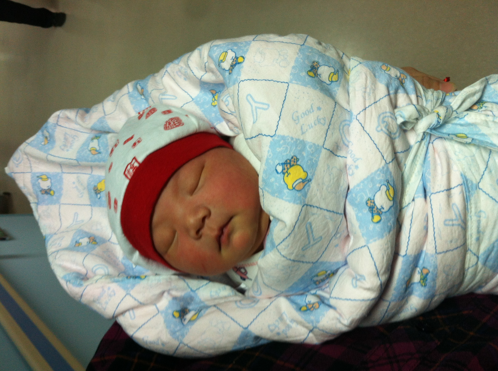
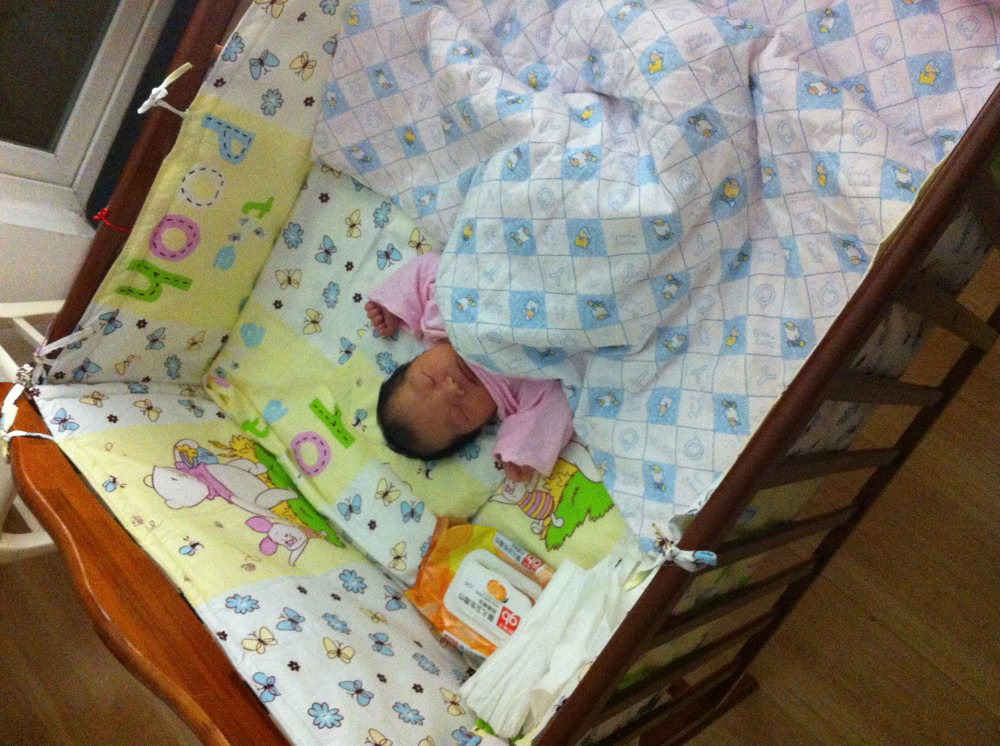

# 2013-12-30 出院

今天上午妈妈一个人努力下床走动了。虽然很疼，但是为了加速血液流动，尽快恢复。勇敢的妈妈坚持走了一个小时。

爸爸预约了周四，办小柔的出生证。需要带上

1. 父母亲的身份证（原件和复印件）
1. 宝宝名字（王婧安）
1. 父母亲的户口地址

联系人：58398213 夏护士

下午妈妈出院了。姥爷也来北京了。全家出动，两辆车，接妈妈回家。

小柔出发前吃饱喝足。一路上五分钟，睡得甜甜的。回到家，睡进了奶奶提前几个月就做好的婴儿床。小小的婴儿床，相对更小更小的小柔，就像一间屋子那么大。婴儿床是奶奶买的上海“好孩子”纯木质。小褥子，四面小围子，小被子，蚕沙小枕头，都是奶奶一针一线为小柔缝制的。奶奶好爱你哟。

妈妈刚换了衣服躺下，小柔就饿醒了。哇哇乱叫着吃了一次母乳，一边吃一边满意的哼哼唧唧。吃了半个小时，小柔吃得都累得睡着了，但是一拿开，就又奋力咬住妈妈的乳头，拒不离开。强制分开，就不满意的哭。只好又喂了一瓶奶粉。这还是妈妈今天早上正式下奶（乳白色的）以后。宝贝儿，你胃口看起来不错的样子。